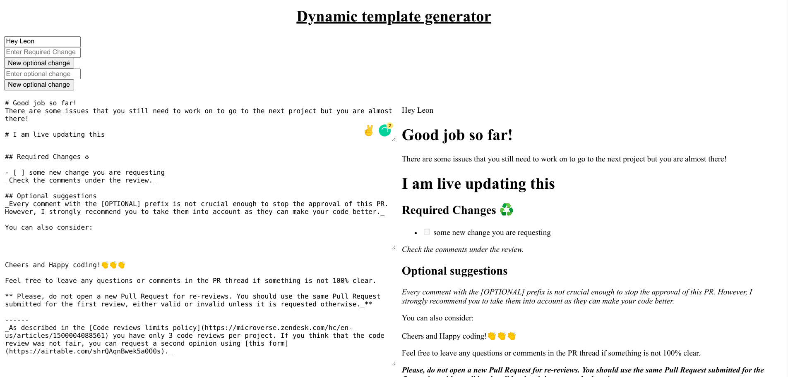

# Code reviwer automation tool
One place for all your code review needs. This is to help code reviewers generate templates for their reviews.
This is in early beta version right now and at the moment supports only a single feature: Markdown template generation for reviews.
Contributions are welcome and much appreciated.

## Getting Started

First, run the development server:

```bash
npm run dev
# or
yarn dev
```

Open [http://localhost:3000](http://localhost:3000) with your browser to see the result.

You can start editing the page by modifying `pages/index.js`. The page auto-updates as you edit the file.

<!-- ### Coming soon
[API routes](https://nextjs.org/docs/api-routes/introduction) can be accessed on [http://localhost:3000/api/hello](http://localhost:3000/api/hello). This endpoint can be edited in `pages/api/hello.js`.

The `pages/api` directory is mapped to `/api/*`. Files in this directory are treated as [API routes](https://nextjs.org/docs/api-routes/introduction) instead of React pages. -->

## Deployed on Vercel

The tool is deployed at [Vercel](https://code-reviewer-automation.vercel.app/)

### App screenshot

